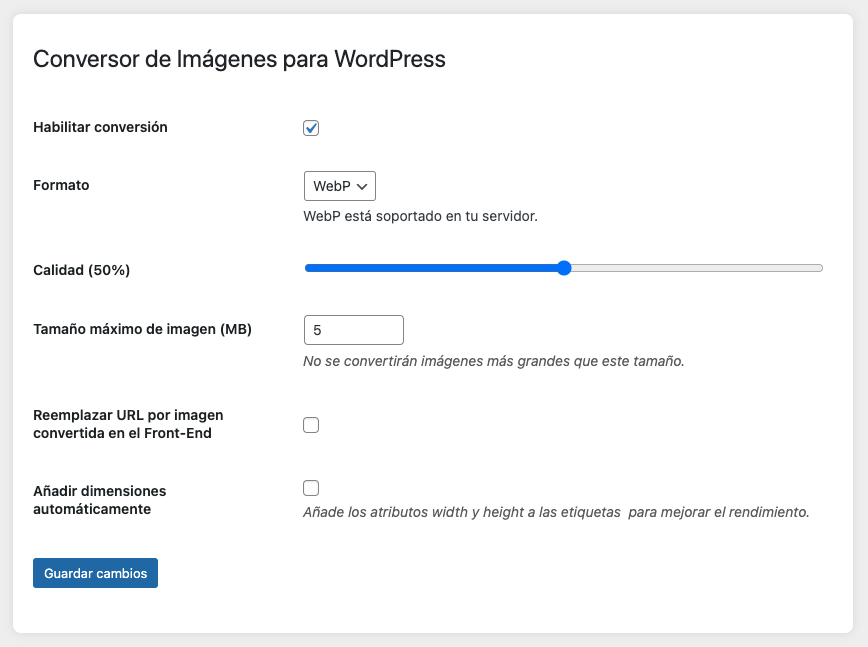

# Conversor de Imágenes para WordPress

Un plugin para WordPress que convierte automáticamente las imágenes subidas a formatos modernos como **WebP** o **AVIF**, optimizando el rendimiento y el SEO de tu sitio web.

---

## Características principales

- **Conversión automática de imágenes**: Convierte imágenes subidas a los formatos WebP o AVIF.
- **Configuración flexible**:
  - Selecciona el formato de salida (WebP o AVIF).
  - Ajusta la calidad de compresión.
  - Define un tamaño máximo para la conversión de imágenes.
- **Reemplazo de URLs en el front-end**: Reemplaza automáticamente las URLs de las imágenes en el contenido por las versiones convertidas.
- **Añadir dimensiones automáticamente**: Añade los atributos `width` y `height` a las etiquetas `` para mejorar el CLS (Cumulative Layout Shift).
- **Interfaz de administración amigable**: Configura el plugin fácilmente desde el panel de administración de WordPress.
- **Compatibilidad con servidores**: Verifica si tu servidor soporta WebP o AVIF antes de habilitar la conversión.

---

## Requisitos

- WordPress 5.0 o superior.
- PHP 7.4 o superior.
- Extensión GD instalada en el servidor (con soporte para WebP y/o AVIF).

---

## Instalación

1. Descarga el plugin desde el repositorio de GitHub.
2. Sube el archivo ZIP a tu sitio WordPress:
   - Ve a **Plugins > Añadir nuevo > Subir plugin**.
   - Selecciona el archivo ZIP y haz clic en **Instalar ahora**.
3. Activa el plugin desde la lista de plugins instalados.

---

## Configuración

1. Ve a **Herramientas > Conversor de Imágenes** en el panel de administración de WordPress.
2. Configura las opciones del plugin:
   - **Habilitar conversión**: Activa o desactiva la conversión de imágenes.
   - **Formato**: Selecciona el formato de salida (WebP o AVIF).
   - **Calidad**: Ajusta la calidad de compresión (0-100%).
   - **Tamaño máximo de imagen**: Define un tamaño máximo (en MB) para la conversión de imágenes.
   - **Reemplazar URL por imagen convertida en el Front-End**: Activa esta opción para reemplazar las URLs de las imágenes en el contenido.
   - **Añadir dimensiones automáticamente**: Activa esta opción para añadir los atributos `width` y `height` a las etiquetas ``.
3. Guarda los cambios.

---

## Uso

Una vez configurado, el plugin funcionará automáticamente:
- Convierte las imágenes subidas al formato seleccionado.
- Reemplaza las URLs de las imágenes en el contenido (si está habilitado).
- Añade los atributos `width` y `height` a las etiquetas `` (si está habilitado).

---

## Capturas de pantalla

### Página de configuración del plugin

---

## Soporte

Si encuentras algún problema o tienes alguna pregunta, por favor:
- Abre un [issue en GitHub](https://github.com/Djimenezlazo/conversor-imagenes-wp/issues).
- O contáctame directamente a través de mi perfil de GitHub: [Djimenezlazo](https://github.com/Djimenezlazo).

---

## Contribuciones

¡Las contribuciones son bienvenidas! Si deseas mejorar el plugin, sigue estos pasos:
1. Haz un fork del repositorio.
2. Crea una rama para tu contribución (`git checkout -b feature/nueva-funcionalidad`).
3. Realiza tus cambios y haz commit (`git commit -m 'Añadir nueva funcionalidad'`).
4. Sube los cambios a tu repositorio (`git push origin feature/nueva-funcionalidad`).
5. Abre un **Pull Request** en GitHub.

---

## Licencia

Este plugin es de código abierto y está licenciado bajo la [Licencia MIT](LICENSE).

---

## Autor

- **David Jiménez Lazo**
- GitHub: [Djimenezlazo](https://github.com/Djimenezlazo)